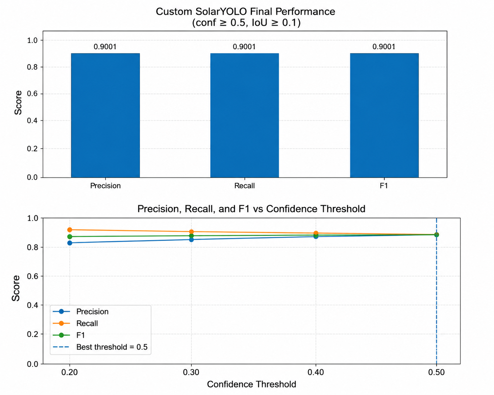
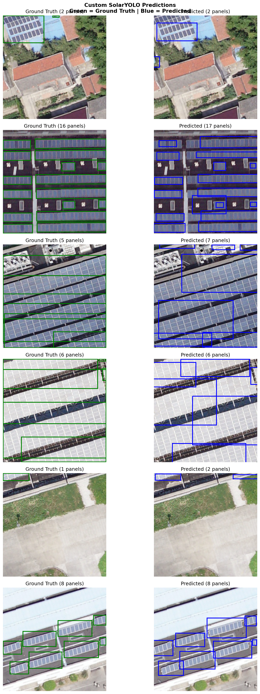

# Solar Panel Detection from Satellite Imagery

An end-to-end computer vision project for detecting photovoltaic solar panels in satellite and aerial imagery using a custom PyTorch detector and YOLOv5 transfer learning.

## Project Overview

This project:

- Reads satellite images and segmentation masks
- Converts segmentation masks into bounding boxes
- Trains a custom YOLO-style CNN from scratch using PyTorch
- Evaluates Precision, Recall, and F1 across confidence thresholds
- Compares the custom detector with YOLOv5 transfer learning
- Visualizes qualitative detection results

## Dataset

This project uses the **PV01 subset** from the Multi-Resolution PV Panel Segmentation Dataset.

Dataset link:

https://www.kaggle.com/datasets/noureldenessam/solarpanels

## Results

Custom model results:

- Precision: 90.01%
- Recall: 90.01%
- F1 Score: 90.01%
- Best confidence threshold: 0.50
- True Positives: 829
- False Positives: 92
- False Negatives: 92

## Performance Visualization



## Qualitative Predictions

Ground-truth boxes are shown in **green**, while custom model predictions are shown in **blue**.



## Technologies

- Python
- PyTorch
- OpenCV
- NumPy
- Matplotlib
- YOLOv5
- Jupyter Notebook

## Repository Structure

```text
solar_panel_detection.ipynb
README.md
.gitignore
assets/
```

## Notebook

The full training, evaluation, visualization, and model-comparison pipeline is available here:

[Open the Solar Panel Detection Notebook](solar_panel_detection.ipynb)

## Model Weights

The best custom SolarYOLO checkpoint was saved as:

```text
solar_panel_best_model.pth
```

The model weight file will be published through a GitHub Release rather than stored directly in the repository.

## Author

**Nourelden Essam**  
AI Engineer and Co-Founder of FN Lab
